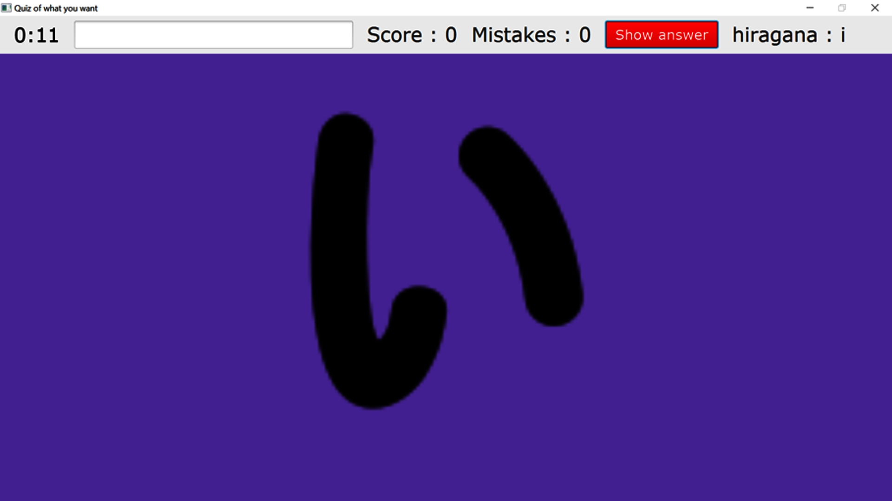

# Quiz-of-what-you-want
## Context:
This game is a personalized quiz developed in “speed run” over 48 hours. A friend wanted to make a quiz about world flags and I wanted to learn my Japanese alphabet so we developed this game. Questions are in image format and answers in the textfield format.

## Gameplay:
This game allows you to create one or more quizzes in a same game and to be able to mix all themes you want. The principle is based on a question in image format and the answer in the textfield format.

  

To answer a question, you must write the answer in the top textfield and press the "Enter" key. If the answer is correct, you earn one point, otherwise you lose one point. While doing a quiz, you can exit the game by writing "exit" in the text field.

## Getting started:
1) In order to be able to customize your quiz, you must first create a text file with the name of your theme (it's easier later). In this file, you will write each answer one below the other.

> Be careful not to leave a space at the end of the answer, this will falsify answers during the game.

2) Then install images that serve as questions. These images must imperatively have the same name as the associated answer in the text file created previously. These images must be in .png or .jpg format to be supported by the game.

> I advise you to put each image group in a specific theme folder for reasons of readability.

3) There is only one step left. Open the preinstalled text file named "txtFileAndPath.txt". In this file, you will write on each line the text file of the theme containing the answer and on this same line separated by a semicolon ";", the path leading to the images corresponding to the theme. The starting point of this path is where the "txtFileAndPath.txt" file itself is located. If you have several themes and if you don't want to add them during next game, you just have to go to this same file and write two dollars "$$" in front of the line that you do not want to use.

> Under no circumstances should the name of this file be changed.

> If you have several topics containing identical answers, only one of the two will be counted, the other will be overwritten when reading the files.

## Example:
1) I create the theme: "anime.txt" which contains my answer on each line:
- anime_1
- anime_2

2) I create a folder in the directory where my game is located that I call "Anime" (for example) which contains questions (images):
- anime_1.png
- anime_2.jpg

3) I open the "txtFileAndPath.txt" file and complete one line per theme (in my case, I only have one theme):
- anime.txt;Anime/

And now, just open the game in .jar to enjoy the quiz we just created ...

## Available:
The game was coded in JavaFx on IntelliJ following the principle of the MVP pattern (model view presentation). The source code is available in this repository and you must download the whole file to be able to open it on IntelliJ or any other code editing software.
The second "The Game" folder contains only the game compiled and builed as a .jar file and all text files are necessary for the game: this is its database. If you only want to play or create quizzes, you can only install this folder.

## State:
- [ ] Work in progress
- [x] Work completed
